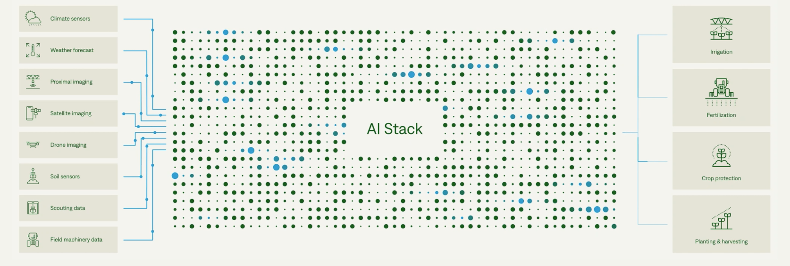

# Sesión 2

- Mapa estratégico (a realizar en la sesión 2)
- Empresas con DATO como activo clave.
- Modelo de Pila de AI (Inteligencia Artificial): 

## Material adicional

- Casos de uso de la sesión 2 + Mejoras en la estructura estratégica para la transformación digital: https://docs.google.com/document/d/1WRspOeTnP7mwxWQTj9lwX462qby7XJk8bYHGwqBESvE/edit#
- Parking Lot: https://docs.google.com/document/d/16VlGemskRVKCsE6TadVmu2arFpnm2XnXfTl9puwy2UA/edit#
- Datos externos INE: https://www.ine.es/index.htm

## Material del caso de uso
- Caso de uso con datos planos: https://cloud.google.com/vertex-ai
- Caso de uso con imagenes: https://cloud.google.com/vertex-ai/docs/start/automl-model-types#image
- AI Automática: watson de IBM.
